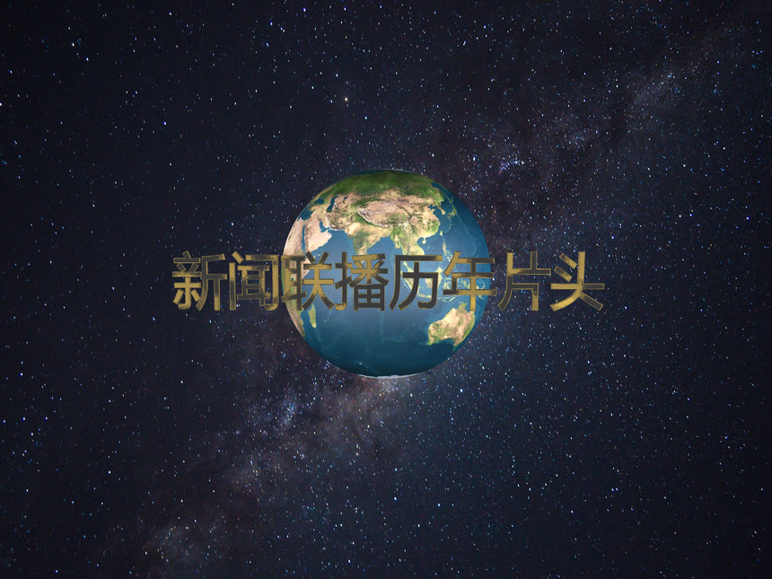
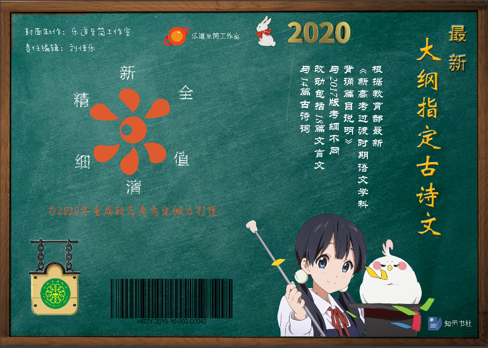
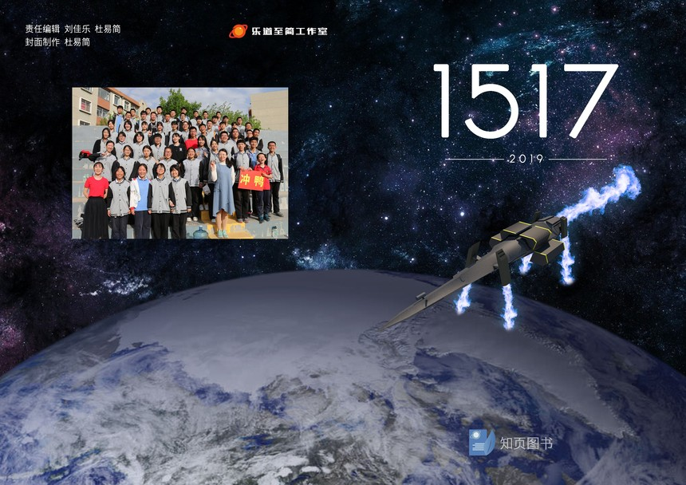

## 乐道至简工作室

知页图书编辑制作中心原名知恒图书编辑制作中心，创立于2014年12月，是一个由一群有想法、爱创作的学生组成的文字创作编辑团队。原名“知恒”是由会社口号“知识即是永恒”简化而来的。自会社成立以来，已经编辑和创作了大量作品。在2019年7月，会社还与山东宇杰科技有限公司达成合作，在众多领域交流学习，工作进展顺利。

### 我们的作品

**【视频】新闻联播历年片头（史上最全最清晰最流畅）**

包括了1978年至今9版新闻联播片头，可称为史上最全最清晰最流畅片头合集。

**2020最新大纲指定古诗文58篇**

根据最新《新高考过渡时期语文学科背诵篇目说明》进行修订，先于时代，优于时代！

**《1517》系列**

大型英语校园小说，含有真实故事与科幻风支线剧情的高难度阅读理解

### 最新情报

- [《新闻联播历年片头》外网播放量战报](http://wansy2019.web.zhanhi.com/wansy2019/vip_doc/16360909.html)
- [【新作视频】新闻联播历年片头于五大平台发布](http://wansy2019.web.zhanhi.com/wansy2019/vip_doc/16360612.html)